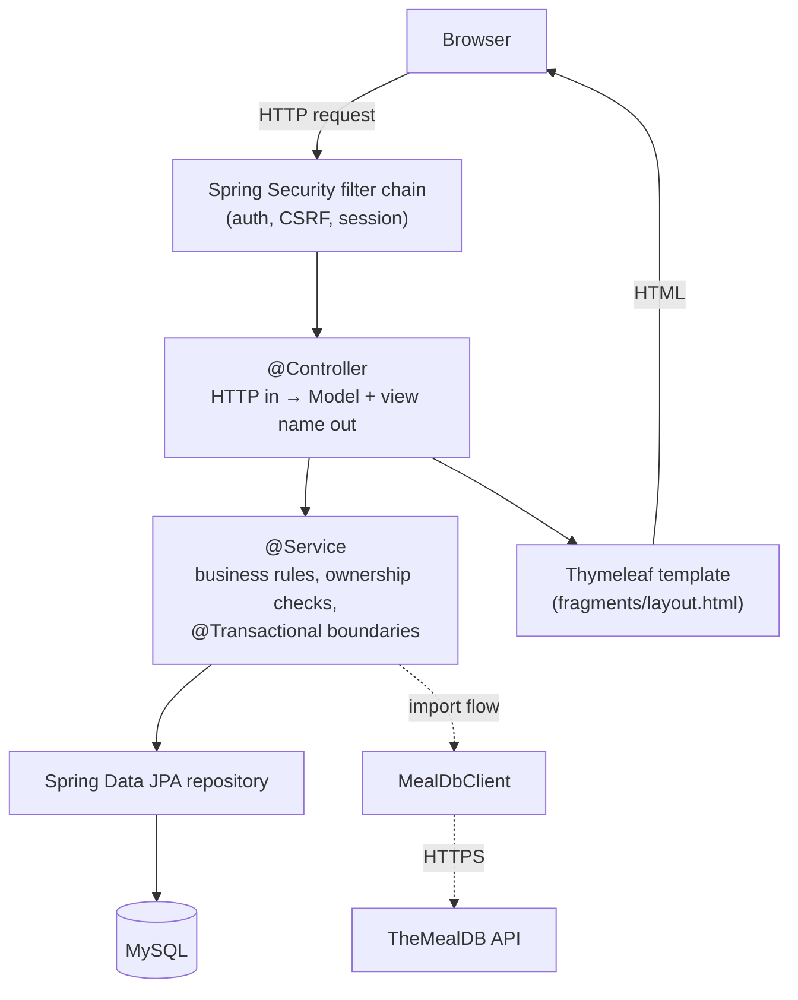
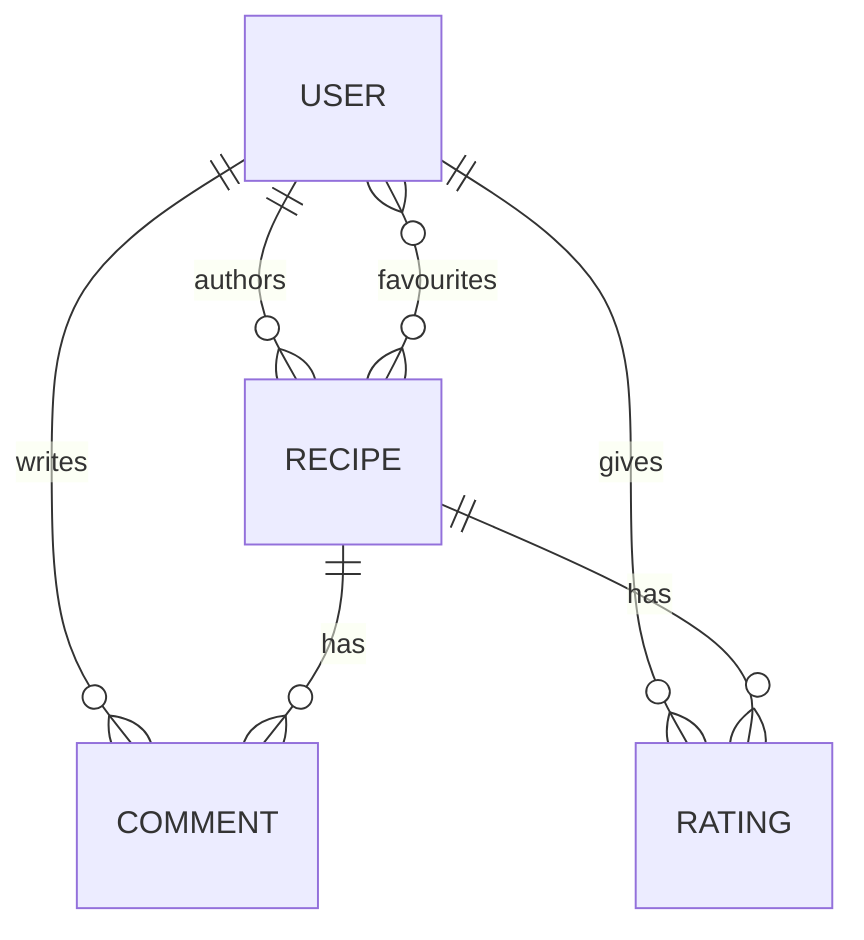
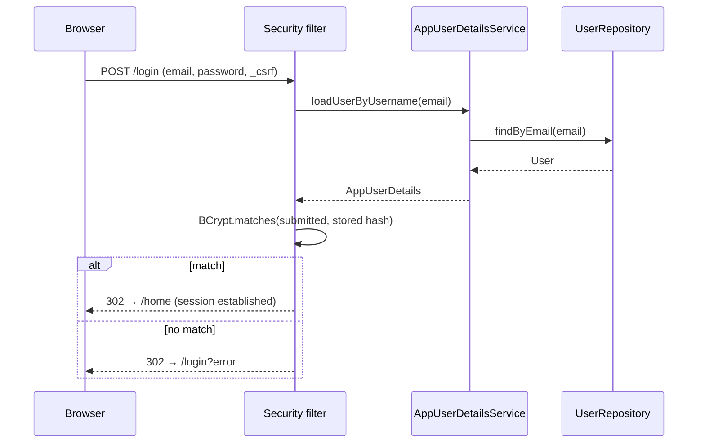

<div align="center">

# 🍲 FOODpApp

**A recipe-sharing web application built with Spring Boot & Thymeleaf.**

Publish your own recipes, browse and filter the community's, rate and comment,
keep a list of favourites, and bootstrap a new recipe from
[TheMealDB](https://www.themealdb.com/). Server-rendered — no front-end framework.


</div>

---

## Table of contents

1. [Overview](#overview)
2. [Features](#features)
3. [Screens](#screens)
4. [Technology stack](#technology-stack)
5. [Architecture](#architecture)
6. [Domain model](#domain-model)
7. [Security model](#security-model)
8. [Getting started](#getting-started)
9. [Configuration reference](#configuration-reference)
10. [HTTP endpoint reference](#http-endpoint-reference)
11. [External integration — TheMealDB](#external-integration--themealdb)
12. [Testing](#testing)
13. [Continuous integration](#continuous-integration)
14. [Project structure](#project-structure)
15. [Troubleshooting](#troubleshooting)
16. [Known limitations & roadmap](#known-limitations--roadmap)
17. [Contributing](#contributing)
18. [License](#license)
19. [Acknowledgements](#acknowledgements)

---

## Overview

FOODpApp is a classic layered Spring MVC application. It began as a migration of
a Flask/SQLAlchemy project to the Spring ecosystem, and now stands on its own as
a compact but complete example of:

- server-side rendering with **Thymeleaf** fragments (no SPA, no build step for the UI),
- **Spring Security** form login with a custom `UserDetails` backed by a JPA entity,
- **Spring Data JPA** over MySQL, with a hand-written schema and `ddl-auto=validate`,
- a thin **controller** layer over a **service** layer that owns all business rules and transactions,
- a typed client for a third-party REST API (**TheMealDB**),
- a test suite spanning unit, web-slice, JPA-slice and full-context tests, wired into **GitHub Actions**.

**Who it's for:** anyone who wants a working reference for "Spring Boot the
boring, correct way" — or wants to run a small recipe site.

---

## Features

### Accounts & profile
- Register with username, email and password (BCrypt-hashed at rest).
- Form-based login / logout; sessions, not tokens.
- Edit profile — change username, email, and/or password. A blank password field
  means "leave it unchanged". A successful change ends in a forced logout, since
  it may alter the identity tied to the session.
- Delete account — removes the user and cascades to their recipes, comments and
  ratings.

### Recipes
- Create, edit and delete **your own** recipes. Editing and deleting are refused
  for anyone who isn't the author (enforced in the service layer).
- **Public browsing** — the recipe list and any single recipe are viewable
  without logging in.
- Each recipe has a title, a description, a free-text ingredient list, step-by-step
  instructions, and up to six optional category tags.

### Discovery
- **Search** matches a term against recipe titles *and* ingredient text.
- **Tag filters** — narrow by temperature, dish type, dairy, sweetness, meat and
  seafood. Any subset combines; an unset filter is simply ignored.
- **Recipe of the day** on the home page — a pseudo-random pick seeded by the
  calendar date, so it's stable for 24 hours.

### Social
- **Ratings** — 1–5 stars, one per user per recipe. Rating again updates your
  existing score. Recipes display a live average.
- **Comments** — leave a note on any recipe.
- **Favourites** — save/unsave recipes to a personal list.

### Import from TheMealDB
- "Surprise Me" fetches a random meal from TheMealDB, converts its 40 flat
  ingredient/measure fields into a clean list, and pre-fills the recipe form.
- You review and edit before it's saved as your own recipe — the review form
  submits to the normal "create recipe" endpoint.

---

## Screens

| Page | Route | Notes |
|---|---|---|
| Home | `/home` | recipe of the day, quick links |
| Browse | `/recipes` | search + six tag filters, card grid, empty state |
| Recipe detail | `/recipes/{id}` | body, comments, star-rating widget, favourite/edit/delete |
| Create / edit / import | `/recipes/new`, `/recipes/{id}/edit`, `/recipes/import/{mealId}` | one shared form template |
| My recipes | `/recipes/mine` | |
| Profile | `/profile` | stats, own recipes, danger-zone delete |
| Edit profile | `/profile/edit` | |
| Favourites | `/profile/favorites` | |
| Login / Register | `/login`, `/register` | |

The UI is Bootstrap 5 with a small custom theme in
`src/main/resources/static/css/app.css` — five CSS custom properties at the top
of that file control the whole palette.

---

## Technology stack

| Area | Choice | Version | Why |
|---|---|---|---|
| Language | Java | 26 | project target (`pom.xml`) |
| Build | Maven Wrapper | 3.9.x (script-only) | no local Maven needed |
| Framework | Spring Boot | 4.1.1 | Web MVC, Security, Data JPA, Validation starters |
| Security | Spring Security | 7.x | form login, BCrypt, CSRF, URL authorization |
| Persistence | Spring Data JPA / Hibernate | 7.x | repositories + entity mapping |
| Database (runtime) | MySQL | 8 | schema in `database/schema.sql` |
| Database (tests) | H2 | (Boot-managed) | in-memory, `create-drop` |
| Templating | Thymeleaf + Spring Security dialect | 3.1.x | server-side HTML, `sec:` attributes |
| UI toolkit | Bootstrap + Bootstrap Icons | 5.3.3 / 1.11.3 | loaded from CDN |
| HTTP client | Spring `RestClient` | (Spring 7) | calls to TheMealDB |
| JSON | Jackson 3 | 3.1.x | request/response binding |
| Testing | JUnit 5, Mockito, AssertJ, Spring Test, `MockRestServiceServer` | (Boot-managed) | unit + slice + integration |
| Dev loop | Spring Boot DevTools | 4.1.1 | template/class hot reload |

---

## Architecture

### Layers



### Request lifecycle

1. The **Security filter chain** runs first: it establishes the session, checks
   the URL against the authorization rules in `SecurityConfig`, and validates the
   CSRF token on every state-changing request.
2. A **controller** method receives typed parameters (`@PathVariable`,
   `@ModelAttribute` form objects with `@Valid`, `@AuthenticationPrincipal
   AppUserDetails`). It does no business logic itself.
3. It calls a **service**. Services hold the `@Transactional` boundary, perform
   ownership and uniqueness checks, and throw `IllegalStateException` for
   "not found" / "not the owner" / "already taken".
4. Services use **repositories** (Spring Data JPA interfaces) for persistence.
5. The controller returns a **view name**; Thymeleaf renders it, pulling shared
   pieces (`head`, `navbar`, `flash`, `recipeCard`, …) from
   `templates/fragments/layout.html`.
6. Every state-changing handler ends in `redirect:` (Post/Redirect/Get) and
   passes user feedback as flash attributes (`message` / `error`).

### Packages

| Package | Responsibility |
|---|---|
| `controller` | `@Controller` classes. HTTP mapping, validation wiring, flash messages, view selection. No business logic. |
| `service` | `RecipeService`, `UserService`. Business rules, ownership/uniqueness checks, transaction boundaries. Read methods are `@Transactional(readOnly = true)` so lazy associations survive into view rendering. |
| `repository` | Spring Data JPA interfaces. One custom `@Query` (`RecipeRepository.search`) drives the whole browse page. |
| `model` | JPA entities: `User`, `Recipe`, `Comment`, `Rating`. Column mapping matches `database/schema.sql` exactly. |
| `dto` | Form-backing objects with Bean Validation constraints (`RegisterForm`, `RecipeForm`, …). |
| `security` | `AppUserDetails` (wraps a `User` for Spring Security) and `AppUserDetailsService` (loads a user by email at login). |
| `config` | `SecurityConfig` — filter chain, URL rules, `PasswordEncoder` bean. |
| `mealdb` | `MealDbClient` plus the typed `Meal` / `Ingredient` records it returns. |

### Key design decisions

- **Business rules live in services, not controllers.** `RecipeService.update`
  and `delete` throw if the caller isn't the author; the controller catches that
  and shows a flash message. Controllers stay trivial and easy to slice-test.
- **The login identifier is the email.** `AppUserDetails.getUsername()` returns
  it and `SecurityConfig` sets `usernameParameter("email")`.
- **`open-in-view` is left on (Boot default)**, so templates can traverse lazy
  associations during rendering. Data that originates from the *detached*
  security principal (e.g. a user's favourites) is re-loaded through a
  `@Transactional` service method first — `open-in-view` does not help a detached
  entity.
- **The database schema is authoritative.** Production runs
  `spring.jpa.hibernate.ddl-auto=validate` against `database/schema.sql`;
  Hibernate never alters the schema. Tests use `create-drop` on H2.
- **TheMealDB's messy shape is contained.** The API returns
  `strIngredient1..20` / `strMeasure1..20` as flat fields; the flattening to a
  `List<Ingredient>` happens only in `Meal.from(Map)`, so the rest of the app
  sees a tidy record.

---

## Domain model



### Tables

**`users`**

| Column | Type | Constraints |
|---|---|---|
| `id` | BIGINT | PK, auto-increment |
| `username` | VARCHAR(32) | NOT NULL, UNIQUE |
| `email` | VARCHAR(255) | NOT NULL, UNIQUE |
| `password_hash` | VARCHAR(100) | NOT NULL (BCrypt) |

**`recipes`**

| Column | Type | Constraints |
|---|---|---|
| `id` | BIGINT | PK, auto-increment |
| `title` | VARCHAR(80) | NOT NULL |
| `description`, `ingredients`, `instructions` | TEXT | NOT NULL |
| `created` | DATETIME | NOT NULL, defaults to now |
| `user_id` | BIGINT | NOT NULL, FK → `users(id)` ON DELETE CASCADE |
| `temperature`, `dish_type`, `dairy`, `sweetness`, `meat`, `seafood` | VARCHAR(20) | nullable tag columns |

**`comments`**

| Column | Type | Constraints |
|---|---|---|
| `id` | BIGINT | PK |
| `user_id` | BIGINT | NOT NULL, FK → `users(id)` ON DELETE CASCADE |
| `recipe_id` | BIGINT | NOT NULL, FK → `recipes(id)` ON DELETE CASCADE |
| `comment` | TEXT | NOT NULL |
| `created` | DATETIME | NOT NULL, defaults to now |

**`ratings`**

| Column | Type | Constraints |
|---|---|---|
| `id` | BIGINT | PK |
| `user_id` | BIGINT | NOT NULL, FK → `users(id)` ON DELETE CASCADE |
| `recipe_id` | BIGINT | NOT NULL, FK → `recipes(id)` ON DELETE CASCADE |
| `value` | TINYINT | NOT NULL, `CHECK (value BETWEEN 1 AND 5)` |
| — | — | `UNIQUE (user_id, recipe_id)` — one rating per user per recipe |

**`favorite_recipes`** (join table)

| Column | Type | Constraints |
|---|---|---|
| `user_id` | BIGINT | FK → `users(id)` ON DELETE CASCADE |
| `recipe_id` | BIGINT | FK → `recipes(id)` ON DELETE CASCADE |
| — | — | PRIMARY KEY (`user_id`, `recipe_id`) |

### Tag vocabulary

The six tag columns are free text, but the create/edit form and the browse
filters share a fixed option list. Keep the two in sync
(`recipe-form.html` ↔ `recipe-list.html`).

| Tag | Options |
|---|---|
| `temperature` | Hot, Cold |
| `dish_type` | Appetizer, Main Course, Side, Dessert, Snack, Drink |
| `dairy` | Dairy, Dairy-Free |
| `sweetness` | Sweet, Savory |
| `meat` | Meat, Vegetarian |
| `seafood` | Seafood, No Seafood |

---

## Security model

### Authentication flow



### Authorization rules

Defined in `SecurityConfig` and evaluated top-down (first match wins):

| Matcher | Access |
|---|---|
| `/`, `/login`, `/register`, `/css/**`, `/images/**` | permit all |
| `/recipes/mine`, `/recipes/new`, `/recipes/*/edit`, `/recipes/random-from-api`, `/recipes/import/**` | authenticated |
| `GET /recipes`, `GET /recipes/*` | permit all (public browse & view) |
| everything else (incl. all mutating `POST /recipes/**`, all `/profile/**`) | authenticated |

### Notes

- **Passwords** are hashed with `BCryptPasswordEncoder`; the plaintext is never
  stored or logged.
- **CSRF protection is on** (Spring Security default). Every form uses
  `th:action="@{…}"` so Thymeleaf injects the hidden token automatically; a
  plain `action="…"` would get a `403` on submit.
- **Logout is a `POST`** (CSRF-protected) — the navbar wraps it in a small form.
- **Sessions**, not JWTs. Deleting your account invalidates the session
  server-side.
- The one public write path is guarded by the fact that all `POST /recipes/**`
  fall through to `authenticated()`.

---

## Getting started

### Prerequisites

- **JDK 26** (`java -version` → 26)
- **MySQL 8**, running locally on `localhost:3306`
- No Maven install needed — use `./mvnw`

### 1. Clone

```bash
git clone https://github.com/LeDuyNg/FoodpApp-Spring-Boot.git
cd FoodpApp-Spring-Boot
```

### 2. Create the database

Scripted (recommended):

```bash
./database/init-db.sh
```

It creates the `foodapp` database and a `foodapp_user`, then applies
`database/schema.sql`. It will prompt for your MySQL **root** password and for a
password to assign the new app user. Override defaults with `DB_NAME`,
`DB_USER`, `DB_PASSWORD` environment variables if you like.

Manual equivalent:

```bash
mysql -u root -p -e "CREATE DATABASE foodapp CHARACTER SET utf8mb4 COLLATE utf8mb4_unicode_ci;"
mysql -u root -p foodapp < database/schema.sql
```

### 3. Configure the datasource

`src/main/resources/application.properties` is **git-ignored** because it holds
credentials. Create it:

```properties
spring.application.name=FoodpApp-Spring-Boot

# --- Database ---
spring.datasource.url=jdbc:mysql://localhost:3306/foodapp?useSSL=false&serverTimezone=UTC
spring.datasource.username=foodapp_user
spring.datasource.password=CHANGE_ME
spring.datasource.driver-class-name=com.mysql.cj.jdbc.Driver

# --- JPA / Hibernate ---
spring.jpa.hibernate.ddl-auto=validate
spring.jpa.properties.hibernate.dialect=org.hibernate.dialect.MySQLDialect
spring.jpa.show-sql=true
spring.jpa.properties.hibernate.format_sql=true
```

### 4. Run

Development (hot reload via DevTools):

```bash
./mvnw spring-boot:run
```

Or build and run the jar:

```bash
./mvnw clean package
java -jar target/FoodpApp-Spring-Boot-0.0.1-SNAPSHOT.jar
```

Open <http://localhost:8080>, click **Join us**, register, log in, and add a
recipe. Try **Surprise Me** in the navbar to import one from TheMealDB.

> **Note:** the UI loads Bootstrap from a CDN, so the app needs an internet
> connection to look right. To go fully offline, download the Bootstrap CSS/JS
> into `src/main/resources/static/` and update the two links in the `head` and
> `scripts` fragments of `templates/fragments/layout.html`.

---

## Configuration reference

Everything is standard Spring Boot configuration. The properties this project
actually depends on:

| Property | Example | Purpose |
|---|---|---|
| `spring.datasource.url` | `jdbc:mysql://localhost:3306/foodapp?useSSL=false&serverTimezone=UTC` | JDBC URL |
| `spring.datasource.username` / `.password` | `foodapp_user` / … | DB credentials |
| `spring.datasource.driver-class-name` | `com.mysql.cj.jdbc.Driver` | MySQL driver |
| `spring.jpa.hibernate.ddl-auto` | `validate` (prod) / `create-drop` (test) | schema strategy — **never `update`/`create` against your real DB** |
| `spring.jpa.properties.hibernate.dialect` | `org.hibernate.dialect.MySQLDialect` | SQL dialect (omit for H2 — auto-detected) |
| `spring.jpa.show-sql` | `true` | log SQL (dev only) |
| `server.port` | `8080` | change the HTTP port |

The **test** profile config lives at `src/test/resources/application.properties`
and is completely self-contained (H2, `create-drop`) — it shadows the main file
during `mvn test`, so a clean checkout can run the suite with no MySQL.

---

## HTTP endpoint reference

`🔒` = authentication required. All `POST` requests require a valid CSRF token.

### Authentication — `AuthController`

| Method | Path | Body / params | Outcome |
|---|---|---|---|
| `GET` | `/login` | — | login page (`login`) |
| `GET` | `/register` | — | sign-up form (`register`) |
| `POST` | `/register` | `username`, `email`, `password` | valid & unique → `redirect:/login`; else re-render with errors |
| `POST` | `/login` | `email`, `password`, `_csrf` | handled by Spring Security → `/home` or `/login?error` |
| `POST` | `/logout` | `_csrf` | handled by Spring Security → `/` |

### Home — `HomeController`

| Method | Path | | Outcome |
|---|---|---|---|
| `GET` | `/` | | `redirect:/home` |
| `GET` | `/home` | 🔒 | home page with `recipeOfTheDay` (may be null) |
| `GET` | `/home/following` | 🔒 | placeholder page (`following`) |

### Recipes — `RecipeController` (prefix `/recipes`)

| Method | Path | | Params / body | Outcome |
|---|---|---|---|---|
| `GET` | `/recipes` | | `title`, `temperature`, `dishType`, `dairy`, `sweetness`, `meat`, `seafood` (all optional) | filtered list (`recipe-list`) |
| `GET` | `/recipes/{id}` | | — | recipe detail (`recipe-view`); 404-style error if missing |
| `GET` | `/recipes/mine` | 🔒 | — | the current user's recipes (`my-recipes`) |
| `GET` | `/recipes/new` | 🔒 | — | empty create form (`recipe-form`) |
| `POST` | `/recipes` | 🔒 | `RecipeForm` | valid → `redirect:/recipes/{newId}`; invalid → re-render form |
| `GET` | `/recipes/{id}/edit` | 🔒 | — | pre-filled form; non-author → flash + `redirect:/recipes/{id}` |
| `POST` | `/recipes/{id}` | 🔒 | `RecipeForm` | valid & author → `redirect:/recipes/{id}`; else re-render / flash error |
| `POST` | `/recipes/{id}/delete` | 🔒 | — | author → `redirect:/recipes/mine`; else flash error |
| `POST` | `/recipes/{id}/comments` | 🔒 | `comment` | `redirect:/recipes/{id}` (flash) |
| `POST` | `/recipes/{id}/ratings` | 🔒 | `rating` (1–5) | upsert, `redirect:/recipes/{id}` (flash) |
| `POST` | `/recipes/{id}/favorite` | 🔒 | — | add to favourites, `redirect:/recipes/{id}` |
| `POST` | `/recipes/{id}/unfavorite` | 🔒 | — | remove from favourites, `redirect:/recipes/{id}` |

### Profile — `ProfileController` (prefix `/profile`)

| Method | Path | | Body | Outcome |
|---|---|---|---|---|
| `GET` | `/profile` | 🔒 | — | profile page: `user`, own `recipes`, `favoriteCount` |
| `GET` | `/profile/edit` | 🔒 | — | edit form pre-filled with username + email |
| `POST` | `/profile` | 🔒 | `UpdateProfileForm` | success → `redirect:/logout`; duplicate/invalid → re-render `profile-edit` |
| `POST` | `/profile/delete` | 🔒 | — | delete account, invalidate session, `redirect:/login` |
| `GET` | `/profile/favorites` | 🔒 | — | favourites list (`favorites`) |

### TheMealDB import — `ExternalRecipeController`

| Method | Path | | Outcome |
|---|---|---|---|
| `GET` | `/recipes/random-from-api` | 🔒 | fetch a random meal → `redirect:/recipes/import/{id}` |
| `GET` | `/recipes/import/{mealId}` | 🔒 | pre-filled review form (`recipe-form`); submits to `POST /recipes` |

---

## External integration — TheMealDB

`MealDbClient` calls the free v1 API at
`https://www.themealdb.com/api/json/v1/1`:

| Method | Endpoint | Used by |
|---|---|---|
| `fetchRandomMeal()` | `GET /random.php` | "Surprise Me" |
| `fetchMealById(id)` | `GET /lookup.php?i={id}` | the import review form |

The response is deserialized loosely (into a `Map`), then converted **once**
into a typed record:

- `Meal.from(Map)` reads the scalar fields and walks `strIngredient1..20` /
  `strMeasure1..20`, skipping blank slots, into a `List<Ingredient>`.
- `strArea` is often `null`; the code falls back to `strCountry`.
- `Meal.description()` composes a non-blank description (`category · area`) so it
  passes `RecipeForm`'s `@NotBlank`.
- `Meal.formattedIngredients()` produces one `"measure name"` line per
  ingredient — the format the recipe form expects.
- A `{"meals": null}` response (unknown id) becomes an
  `IllegalStateException("Meal not found")`.

The `RestClient` is built from an injectable builder so tests can bind a
`MockRestServiceServer` to it.

---

## Testing

**60 tests** across unit, web-slice, JPA-slice and full-context styles. They run
entirely on in-memory **H2** — no MySQL required, and your development database
is never touched.

### Running

```bash
./mvnw test                    # everything
./mvnw verify                  # tests + package the jar (the CI command)
./mvnw test -Dtest=MealTest
./mvnw test -Dtest='*ControllerTest'
./mvnw test -Dtest=UserServiceTest#register_storesTheHashedPasswordNeverThePlaintext
```

Reports: console output plus `target/surefire-reports/`.

### Suites

| Suite | Style | What it pins down |
|---|---|---|
| `RecipeServiceTest` | Mockito unit | rating upsert (insert vs. update), author-only update/delete, `findById` throw, blank→null search normalisation |
| `UserServiceTest` | Mockito unit | password is hashed not stored raw; `updateProfile` only touches changed fields and rejects a taken email/username; favourites helpers |
| `AuthControllerTest` | `@WebMvcTest` | register/login views, validation re-render, duplicate email → field error, success redirect, missing CSRF → 403 |
| `HomeControllerTest` | `@WebMvcTest` | `/` → `/home`, `recipeOfTheDay` on the model, `/home` behind the login wall |
| `RecipeControllerTest` | `@WebMvcTest` | public vs. login-only routes, create happy/validation paths, delete redirect, CSRF |
| `ProfileControllerTest` | `@WebMvcTest` | profile model, edit-form prefill, update → logout, duplicate → field error, delete → login, CSRF |
| `ExternalRecipeControllerTest` | `@WebMvcTest` | random → redirect, import → pre-filled `recipe-form`, login wall |
| `RecipeRepositoryTest` | `@DataJpaTest` | the hand-written `search` `@Query` — no filter, title/ingredient match, tag filter, combined |
| `MealTest` | plain unit | TheMealDB's 40 flat fields → typed `Meal`, using the real `papaya-salad.json` fixture |
| `MealDbClientTest` | `MockRestServiceServer` | request URLs, body → `Meal`, `"meals": null` → exception |
| `FoodpAppSpringBootApplicationTests` | `@SpringBootTest` | the full application context starts |

### Conventions for new tests

- **Service logic** → Mockito unit test, mock the repositories.
- **A controller** → `@WebMvcTest(TheController.class)` + `@Import(SecurityConfig.class)`,
  `@MockitoBean` its collaborators. Authenticate with
  `.with(user(new AppUserDetails(userWithId)))` (the templates read
  `principal.user.username`), and add `.with(csrf())` to every `POST`.
- **A custom `@Query`** → `@DataJpaTest` with `TestEntityManager`.
- **External HTTP** → bind `MockRestServiceServer` to a `RestClient.Builder`.

---

## Continuous integration

`.github/workflows/ci.yml`:

- **Triggers:** push and pull request to `master` or `main`.
- **Runner:** `ubuntu-latest`, Temurin JDK 26, Maven dependency cache.
- **Step:** `./mvnw --batch-mode --no-transfer-progress verify` — compiles, runs
  all 60 tests, and builds the jar.
- **Artifact:** `target/surefire-reports/` is uploaded on every run (including
  failures).

No database service is needed in CI because the tests use H2.

---

## Project structure

```
FoodpApp-Spring-Boot/
├── .github/workflows/ci.yml         GitHub Actions pipeline
├── database/
│   ├── init-db.sh                   creates DB + user, applies schema
│   └── schema.sql                   authoritative MySQL schema
├── src/main/
│   ├── java/com/leduynguyen/foodpappspringboot/
│   │   ├── FoodpAppSpringBootApplication.java
│   │   ├── config/       SecurityConfig
│   │   ├── controller/   Auth, Home, Recipe, Profile, ExternalRecipe
│   │   ├── dto/          *Form classes (bean validation)
│   │   ├── mealdb/       MealDbClient, Meal, Ingredient
│   │   ├── model/        User, Recipe, Comment, Rating  (@Entity)
│   │   ├── repository/   *Repository (Spring Data JPA)
│   │   ├── security/     AppUserDetails, AppUserDetailsService
│   │   └── service/      RecipeService, UserService
│   └── resources/
│       ├── application.properties   (git-ignored — create it, see Getting started)
│       ├── static/css/app.css       custom theme
│       └── templates/               Thymeleaf pages + fragments/layout.html
├── src/test/
│   ├── java/…                       the 11 test classes above
│   └── resources/
│       ├── application.properties   H2 config for the test run
│       └── mealdb/papaya-salad.json test fixture
├── mvnw / mvnw.cmd                  Maven Wrapper
└── pom.xml
```

---

## Troubleshooting

| Symptom | Cause & fix |
|---|---|
| `Failed to configure a DataSource: 'url' attribute is not specified` | `src/main/resources/application.properties` is missing. Create it (see [Getting started](#getting-started)). |
| `Schema-validation: missing table [recipes]` at startup | The schema hasn't been applied to the DB the app points at. Run `./database/init-db.sh` (or `mysql … < database/schema.sql`). |
| `Access denied for user 'foodapp_user'@'localhost'` | Wrong `spring.datasource.password`, or the user wasn't created. Re-run `init-db.sh`. |
| `403 Forbidden` on a form submit while logged in | The form used a plain `action="…"` instead of `th:action="@{…}"`, so no CSRF token was sent. |
| `LazyInitializationException` in a template | Something handed a template a lazy association off a detached entity. Load it through a `@Transactional` service method (see `UserService.favoritesOf`). Do **not** set `open-in-view=false`. |
| Whitelabel error page, no stack trace in the browser | The real exception is always in the application console log — check there. Usually a missing/misnamed template or an unmapped URL. |
| Styling looks broken (unstyled HTML) | No internet connection — Bootstrap is loaded from a CDN. See the note in [Getting started](#getting-started). |
| CI fails at "Set up JDK 26" | Temurin 26 not yet published for the runner. Bump `java-version` in the workflow **and** `<java.version>` in `pom.xml` together. |

---

## Known limitations & roadmap

- **No pagination** — the browse list and "my recipes" load every matching row.
- **No image uploads** — recipes are text only; imported meals don't keep their photo.
- **`/home/following`** is a placeholder; there is no follow feature.
- **Recipe-of-the-day** scans all recipes in memory; fine for a small dataset.
- **Deleting a recipe that others have favourited** relies on the database's
  `ON DELETE CASCADE` on `favorite_recipes` — verify this path if you change the
  JPA cascade config.
- Ideas: pagination, a proper `Meal` sub-type instead of the map boundary, image
  uploads, an account-level activity feed, rate-limiting the TheMealDB calls.

---

## Contributing

```bash
./mvnw verify        # compile + test + package; must pass before a PR
```

- Java is formatted to the standard IntelliJ/Google-ish style; match the
  surrounding code.
- Keep controllers thin — new rules go in a service, with a test.
- Every new endpoint or `@Query` gets a test (see
  [conventions](#conventions-for-new-tests)).
- Update this README's [endpoint reference](#http-endpoint-reference) when routes
  change.

---

## License

No license is currently declared for this repository (`pom.xml` leaves the
`<licenses>` block empty and there is no `LICENSE` file). Until one is added, all
rights are reserved by the author. To make it open source, add a `LICENSE` file
(e.g. MIT) and fill in the `pom.xml` licence block.

---

## Acknowledgements

- **[TheMealDB](https://www.themealdb.com/)** — free recipe API used by the import feature.
- **[Bootstrap](https://getbootstrap.com/)** & **[Bootstrap Icons](https://icons.getbootstrap.com/)** — UI toolkit.
- **[Spring Boot](https://spring.io/projects/spring-boot)** and the wider Spring ecosystem.
- Fonts: **Fraunces** (headings) and **Nunito** (body) via Google Fonts.
